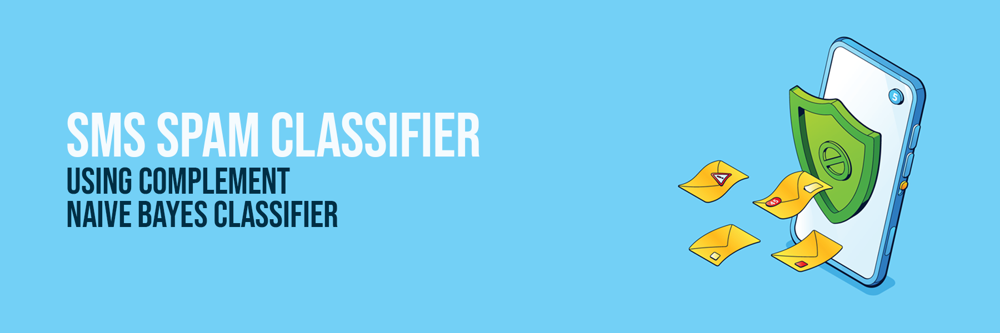
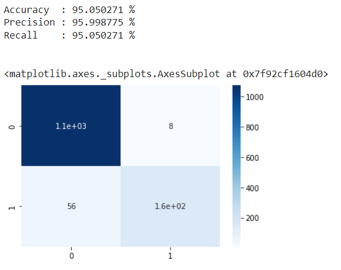

 
  

In this project, I have attempted to analyze the SMS spam dataset and build a machine learning model to predict whether the message is spam or not.

## :floppy_disk: Project Files Description</h2>

This project contains an executable iPython Notebook, a presentation and source as follows:

<h4>Executable Files:</h4>
<ul>
  <li><b>SMS_Spam_Classifier.ipynb</b> - Google Colab notebook containing data summary, exploration, visualisations, text processing, modelling and performance evaluation.</li>
</ul>

<h4>Source Directory:</h4>
<ul>
  <li><b>SMSSpamCollection</b> - Includes SMS spam collection.</li>
</ul>

## :book: Problem Statement

Almost every person today owns a mobile phone with messaging and calling capabilities. Spam calls are infamous for the constant ringing of cell phones they often initiate to get promotional or fraudulent information to innocent customers. However, with the cheaper rates on bulk messaging services from wireless networks, a swarm of these spam calls has quickly shifted over to SMS messaging. There, in this scenario, classification becomes mandatory.
The objective of this project is to understand the SMS spam collection dataset and build a machine learning model to predict whether the mail is spam or not.

## :book: Approach

1.	Understanding the business task.
2.	Reading data from files given.
3.	Data pre-processing.
4.	Data visualization.
5.	Text processing.
6.	Modelling data.
7.	Conclusion.

## :book: Modelling

<li>Lets use complement naive bayes classifier for training as each feature represents the frequency of the word in each message and to correct the severe assumptions made due to the imbalanced dataset.</li> 
<li>Bag-of-Words is used for feature extraction from text since just the frequency of words needs to be considered instead of their importance.</li> 
<li>Both of these processes are combined in a pipeline.</li>

## 📘: Conclusion

## :scroll: Credits

Midhun R | Avid Learner | Data Analyst | Data Scientist | Machine Learning Enthusiast

 <i> Contact me for Data Science Project Collaborations</i>

## :books: References
<ul>
  <li>
Analytics Vidhya, 'Stemming vs Lemmatization in NLP: Must-Know Differences'. [Online].

      
Available: https://www.analyticsvidhya.com/blog/2022/06/stemming-vs-lemmatization-in-nlp-must-know-differences/

  </li>
  <li>
Medium, 'Fundamentals of Bag Of Words and TF-IDF'. [Online].

      
Available: https://medium.com/analytics-vidhya/fundamentals-of-bag-of-words-and-tf-idf-9846d301ff22/

  </li>
  <li>
Scikit-learn, 'sklearn.naive_bayes.ComplementNB'. [Online].

      
Available: https://scikit-learn.org/stable/modules/generated/sklearn.naive_bayes.ComplementNB.html/

  </li>
</ul>

<a href="https://www.freepik.com/free-vector/anti-spam-protection-landing-page-concept-email-security-safety-web-mail-system-vector-banner-filter-service-from-phishing-junk-messages-with-isometric-smartphone-shield-letters_24499395.htm#query=spam&position=32&from_view=search&track=sph">Image by upklyak</a> on Freepik
